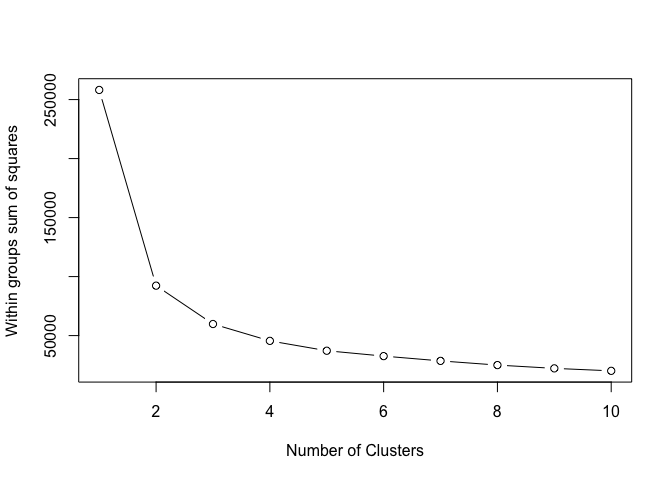
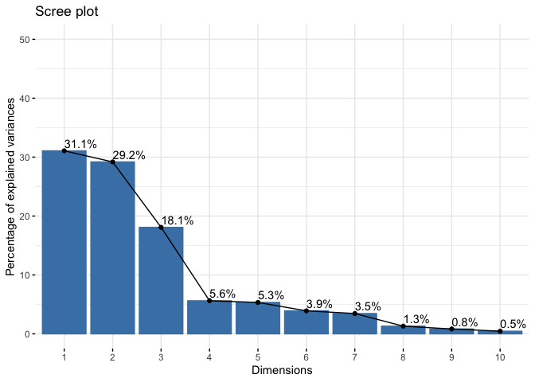
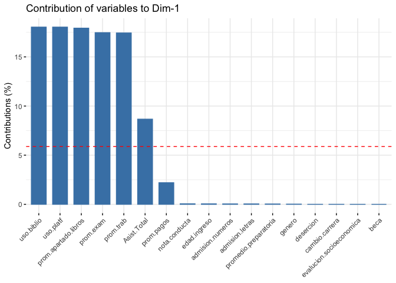

Proyecto Final - Clustering Kmeans
================
Anna Casillas
Agosto 1,2020

# Clustering Kmeans

Equipo:

  - Anna Karen Casillas
  - Josue Emmnanuel Gomez
  - Luis Francisco Gonzalez

## Variables y Dependencias Iniciales

Aqui se especifican las variables generales necesarias para todo el
proyecto

``` r
#Modificar variable para especificar directorio del Proyecto Final
user.path <- "/Users/akcasill/Documents/analisisDatos/proyecto/mcc-analisisdatos-final"

local.path <- paste(user.path ,"/data",sep = "")
local.path.imgs <- paste(user.path ,"/imgs",sep = "")
```

Aqui se especifican todas las dependencias que se utilizaran en el
proyecto

``` r
#Dependencies
#install.packages("png")
library(png)
library(corrplot)
```

    ## corrplot 0.84 loaded

``` r
source("http://www.sthda.com/upload/rquery_cormat.r")
col<- colorRampPalette(c("blue", "white", "red"))(20)
#install.packages("factoextra")
#install.packages("FactoMineR")
library(FactoMineR)
library(factoextra)
```

    ## Loading required package: ggplot2

    ## Welcome! Want to learn more? See two factoextra-related books at https://goo.gl/ve3WBa

Cargamos los datos integrados

``` r
setwd(local.path)
load("datos.integrados.R")
#datos.integrados.df
head(datos.integrados.df,3)
```

    ##   genero admision.letras admision.numeros promedio.preparatoria edad.ingreso
    ## 1      2        60.09373         35.18746              70.28119           18
    ## 2      2        59.07874         33.15747              67.23621           17
    ## 3      2        53.14335         21.28669              60.00000           15
    ##   evalucion.socioeconomica nota.conducta beca Asist.Total prom.trab prom.exam
    ## 1                        4            16    0   0.8750000  12.47364  12.51429
    ## 2                        4            15    0   0.8567708  13.13827  13.10560
    ## 3                        4            13    0   0.8424479  12.53885  12.51326
    ##   prom.pagos prom.uso.biblio uso.biblio prom.uso.platf uso.platf
    ## 1          2        15.50000          2          38.50         2
    ## 2          0        18.16667          3          42.75         3
    ## 3          0        15.25000          1          35.50         1
    ##   prom.apartado.libros cambio.carrera
    ## 1             1.250000              0
    ## 2             1.333333              0
    ## 3             1.083333              0

## Particion de Datos

Separamos 100 alumnos que no entraran en Kmeans.

``` r
set.seed(1234)

alumnos.gen <- sample(x=c(0,1),size=nrow(datos.integrados.df), replace=TRUE,prob = c(0.9,0.1))

#alumnos.gen
head(alumnos.gen,5)
```

    ## [1] 0 0 0 0 0

``` r
alumnos.nuevos <- datos.integrados.df[alumnos.gen==1,]
alumnos.actuales <- datos.integrados.df[alumnos.gen==0,]
setwd(local.path)
save(alumnos.nuevos, file="alumnos.nuevos.R")
save(alumnos.actuales, file="alumnos.actuales.R")

#alumnos.nuevos
head(alumnos.nuevos,5)
```

    ##    genero admision.letras admision.numeros promedio.preparatoria edad.ingreso
    ## 14      2        64.93722         44.87445              84.81167           19
    ## 28      2        55.63921         26.27841              60.00000           16
    ## 39      1        58.37728         31.75456              65.13184           17
    ## 81      1        62.96414         40.92828              78.89242           19
    ## 92      1        59.04259         33.08518              67.12776           17
    ##    evalucion.socioeconomica nota.conducta beca Asist.Total prom.trab prom.exam
    ## 14                        4            17    0   0.8828125  12.36401  12.39782
    ## 28                        4            14    0   0.7669271  12.25492  12.22629
    ## 39                        4            15    0   0.9296875  13.08116  13.06243
    ## 81                        2            17    1   0.7851562  12.53885  12.51326
    ## 92                        3            15    0   0.8203125  12.25492  12.22629
    ##    prom.pagos prom.uso.biblio uso.biblio prom.uso.platf uso.platf
    ## 14          2        17.08333          2       41.50000         2
    ## 28          2        13.91667          0       33.33333         0
    ## 39          2        18.08333          3       42.08333         3
    ## 81          0        15.25000          1       35.50000         1
    ## 92          2        13.91667          0       33.33333         0
    ##    prom.apartado.libros cambio.carrera
    ## 14             1.166667              0
    ## 28             1.000000              0
    ## 39             1.333333              0
    ## 81             1.083333              0
    ## 92             1.000000              0

``` r
#alumnos.actuales
head(alumnos.actuales,5)
```

    ##   genero admision.letras admision.numeros promedio.preparatoria edad.ingreso
    ## 1      2        60.09373         35.18746              70.28119           18
    ## 2      2        59.07874         33.15747              67.23621           17
    ## 3      2        53.14335         21.28669              60.00000           15
    ## 4      1        57.00416         29.00832              61.01248           16
    ## 5      2        61.47273         37.94545              74.41818           18
    ##   evalucion.socioeconomica nota.conducta beca Asist.Total prom.trab prom.exam
    ## 1                        4            16    0   0.8750000  12.47364  12.51429
    ## 2                        4            15    0   0.8567708  13.13827  13.10560
    ## 3                        4            13    0   0.8424479  12.53885  12.51326
    ## 4                        4            14    0   0.9153646  14.21924  14.17651
    ## 5                        4            16    0   0.8437500  12.44557  12.39884
    ##   prom.pagos prom.uso.biblio uso.biblio prom.uso.platf uso.platf
    ## 1          2        15.50000          2       38.50000         2
    ## 2          0        18.16667          3       42.75000         3
    ## 3          0        15.25000          1       35.50000         1
    ## 4          2        25.41667          7       58.50000         7
    ## 5          2        15.75000          2       36.16667         2
    ##   prom.apartado.libros cambio.carrera
    ## 1             1.250000              0
    ## 2             1.333333              0
    ## 3             1.083333              0
    ## 4             1.916667              0
    ## 5             1.083333              0

``` r
summary(alumnos.nuevos)
```

    ##  genero admision.letras admision.numeros promedio.preparatoria  edad.ingreso
    ##  1:45   Min.   :44.94   Min.   : 4.878   Min.   : 60.00        17     :28   
    ##  2:75   1st Qu.:57.09   1st Qu.:29.176   1st Qu.: 61.26        19     :26   
    ##         Median :59.97   Median :34.947   Median : 69.92        18     :16   
    ##         Mean   :60.08   Mean   :35.167   Mean   : 72.31        16     :15   
    ##         3rd Qu.:63.28   3rd Qu.:41.556   3rd Qu.: 79.83        20     :13   
    ##         Max.   :72.00   Max.   :58.992   Max.   :100.00        15     :12   
    ##                                                                (Other):10   
    ##  evalucion.socioeconomica nota.conducta   beca    Asist.Total    
    ##  1: 6                     Min.   : 9.00   0:99   Min.   :0.7578  
    ##  2:15                     1st Qu.:14.00   1:21   1st Qu.:0.8809  
    ##  3:16                     Median :15.00          Median :0.9160  
    ##  4:83                     Mean   :15.52          Mean   :0.9018  
    ##                           3rd Qu.:17.00          3rd Qu.:0.9362  
    ##                           Max.   :20.00          Max.   :0.9479  
    ##                                                                  
    ##    prom.trab       prom.exam       prom.pagos    prom.uso.biblio
    ##  Min.   :11.81   Min.   :11.73   Min.   :0.000   Min.   :13.00  
    ##  1st Qu.:12.55   1st Qu.:12.51   1st Qu.:1.875   1st Qu.:16.65  
    ##  Median :13.31   Median :13.27   Median :2.000   Median :21.12  
    ##  Mean   :13.49   Mean   :13.46   Mean   :1.532   Mean   :22.03  
    ##  3rd Qu.:14.25   3rd Qu.:14.23   3rd Qu.:2.000   3rd Qu.:26.65  
    ##  Max.   :16.09   Max.   :16.09   Max.   :2.000   Max.   :39.67  
    ##                                                                 
    ##    uso.biblio     prom.uso.platf    uso.platf      prom.apartado.libros
    ##  Min.   : 0.000   Min.   :30.58   Min.   : 0.000   Min.   :0.9167      
    ##  1st Qu.: 2.000   1st Qu.:38.98   1st Qu.: 2.000   1st Qu.:1.1667      
    ##  Median : 5.000   Median :50.00   Median : 5.000   Median :1.5000      
    ##  Mean   : 5.167   Mean   :51.88   Mean   : 5.167   Mean   :1.6090      
    ##  3rd Qu.: 8.000   3rd Qu.:61.29   3rd Qu.: 8.000   3rd Qu.:1.9375      
    ##  Max.   :11.000   Max.   :96.83   Max.   :11.000   Max.   :2.8333      
    ##                                                                        
    ##  cambio.carrera
    ##  0:110         
    ##  1: 10         
    ##                
    ##                
    ##                
    ##                
    ## 

``` r
summary(alumnos.actuales)
```

    ##  genero  admision.letras admision.numeros promedio.preparatoria  edad.ingreso
    ##  1:360   Min.   :44.99   Min.   : 4.986   Min.   : 60.00        17     :172  
    ##  2:520   1st Qu.:56.59   1st Qu.:28.187   1st Qu.: 60.00        18     :151  
    ##          Median :60.04   Median :35.076   Median : 70.11        19     :140  
    ##          Mean   :60.05   Mean   :35.107   Mean   : 72.24        16     :125  
    ##          3rd Qu.:63.67   3rd Qu.:42.335   3rd Qu.: 81.00        20     :100  
    ##          Max.   :77.71   Max.   :70.411   Max.   :100.00        15     : 86  
    ##                                                                 (Other):106  
    ##  evalucion.socioeconomica nota.conducta   beca     Asist.Total    
    ##  1: 50                    Min.   : 9.00   0:738   Min.   :0.7161  
    ##  2: 92                    1st Qu.:14.00   1:142   1st Qu.:0.8633  
    ##  3:136                    Median :15.50           Median :0.9089  
    ##  4:602                    Mean   :15.53           Mean   :0.8957  
    ##                           3rd Qu.:17.00           3rd Qu.:0.9362  
    ##                           Max.   :20.00           Max.   :0.9479  
    ##                                                                   
    ##    prom.trab       prom.exam       prom.pagos    prom.uso.biblio
    ##  Min.   :11.55   Min.   :11.54   Min.   :0.000   Min.   :11.58  
    ##  1st Qu.:12.63   1st Qu.:12.60   1st Qu.:0.000   1st Qu.:16.75  
    ##  Median :13.35   Median :13.33   Median :1.875   Median :20.88  
    ##  Mean   :13.45   Mean   :13.43   Mean   :1.399   Mean   :21.62  
    ##  3rd Qu.:14.14   3rd Qu.:14.10   3rd Qu.:2.000   3rd Qu.:25.58  
    ##  Max.   :16.22   Max.   :16.23   Max.   :2.000   Max.   :39.17  
    ##                                                                 
    ##    uso.biblio     prom.uso.platf    uso.platf      prom.apartado.libros
    ##  Min.   : 0.000   Min.   :28.17   Min.   : 0.000   Min.   :0.8333      
    ##  1st Qu.: 2.000   1st Qu.:39.21   1st Qu.: 2.000   1st Qu.:1.2500      
    ##  Median : 5.000   Median :48.58   Median : 5.000   Median :1.5000      
    ##  Mean   : 5.025   Mean   :50.81   Mean   : 5.025   Mean   :1.5790      
    ##  3rd Qu.: 7.000   3rd Qu.:59.88   3rd Qu.: 7.000   3rd Qu.:1.9167      
    ##  Max.   :12.000   Max.   :95.75   Max.   :12.000   Max.   :2.7500      
    ##                                                                        
    ##  cambio.carrera
    ##  0:790         
    ##  1: 90         
    ##                
    ##                
    ##                
    ##                
    ## 

Separamos 70-30 training set.

``` r
set.seed(1234)

alumnos.sep <- sample(x=c(0,1),size=nrow(alumnos.actuales),replace=TRUE,prob = c(0.7,0.3))
#alumnos.sep
head(alumnos.sep,3)
```

    ## [1] 0 0 0

``` r
alumnos.training <- alumnos.actuales[alumnos.sep==0,]
alumnos.test <- alumnos.actuales[alumnos.sep==1,]
setwd(local.path)
save(alumnos.training, file="alumnos.training.R")
save(alumnos.test, file="alumnos.test.R")

str(alumnos.training)
```

    ## 'data.frame':    613 obs. of  18 variables:
    ##  $ genero                  : Factor w/ 2 levels "1","2": 2 2 2 1 2 2 2 1 2 1 ...
    ##  $ admision.letras         : num  60.1 59.1 53.1 57 61.9 ...
    ##  $ admision.numeros        : num  35.2 33.2 21.3 29 38.9 ...
    ##  $ promedio.preparatoria   : num  70.3 67.2 60 61 75.8 ...
    ##  $ edad.ingreso            : Factor w/ 15 levels "11","12","13",..: 8 7 5 6 8 5 7 4 7 10 ...
    ##  $ evalucion.socioeconomica: Factor w/ 4 levels "1","2","3","4": 4 4 4 4 4 4 4 4 4 4 ...
    ##  $ nota.conducta           : num  16 15 13 14 16 13 15 12 15 18 ...
    ##  $ beca                    : Factor w/ 2 levels "0","1": 1 1 1 1 1 1 1 1 1 1 ...
    ##  $ Asist.Total             : num  0.875 0.857 0.842 0.915 0.876 ...
    ##  $ prom.trab               : num  12.5 13.1 12.5 14.2 13.5 ...
    ##  $ prom.exam               : num  12.5 13.1 12.5 14.2 13.4 ...
    ##  $ prom.pagos              : num  2 0 0 2 0 0 2 2 2 2 ...
    ##  $ prom.uso.biblio         : num  15.5 18.2 15.2 25.4 24.8 ...
    ##  $ uso.biblio              : num  2 3 1 7 5 11 6 1 7 1 ...
    ##  $ prom.uso.platf          : num  38.5 42.8 35.5 58.5 63.2 ...
    ##  $ uso.platf               : num  2 3 1 7 5 11 6 1 7 1 ...
    ##  $ prom.apartado.libros    : num  1.25 1.33 1.08 1.92 1.92 ...
    ##  $ cambio.carrera          : Factor w/ 2 levels "0","1": 1 1 1 1 1 1 1 1 1 1 ...

``` r
summary(alumnos.training)
```

    ##  genero  admision.letras admision.numeros promedio.preparatoria  edad.ingreso
    ##  1:244   Min.   :46.78   Min.   : 8.562   Min.   : 60.00        17     :114  
    ##  2:369   1st Qu.:56.55   1st Qu.:28.093   1st Qu.: 60.00        18     :110  
    ##          Median :60.12   Median :35.244   Median : 70.37        19     : 96  
    ##          Mean   :60.10   Mean   :35.203   Mean   : 72.36        16     : 87  
    ##          3rd Qu.:63.78   3rd Qu.:42.558   3rd Qu.: 81.34        20     : 71  
    ##          Max.   :77.71   Max.   :70.411   Max.   :100.00        15     : 64  
    ##                                                                 (Other): 71  
    ##  evalucion.socioeconomica nota.conducta   beca     Asist.Total    
    ##  1: 37                    Min.   :10.00   0:522   Min.   :0.7161  
    ##  2: 54                    1st Qu.:14.00   1: 91   1st Qu.:0.8633  
    ##  3: 94                    Median :16.00           Median :0.9115  
    ##  4:428                    Mean   :15.55           Mean   :0.8967  
    ##                           3rd Qu.:17.00           3rd Qu.:0.9375  
    ##                           Max.   :20.00           Max.   :0.9479  
    ##                                                                   
    ##    prom.trab       prom.exam       prom.pagos    prom.uso.biblio
    ##  Min.   :11.55   Min.   :11.54   Min.   :0.000   Min.   :11.58  
    ##  1st Qu.:12.62   1st Qu.:12.60   1st Qu.:0.000   1st Qu.:16.75  
    ##  Median :13.35   Median :13.34   Median :1.875   Median :21.00  
    ##  Mean   :13.48   Mean   :13.45   Mean   :1.391   Mean   :21.77  
    ##  3rd Qu.:14.18   3rd Qu.:14.14   3rd Qu.:2.000   3rd Qu.:25.67  
    ##  Max.   :16.22   Max.   :16.23   Max.   :2.000   Max.   :37.58  
    ##                                                                 
    ##    uso.biblio     prom.uso.platf    uso.platf      prom.apartado.libros
    ##  Min.   : 0.000   Min.   :28.17   Min.   : 0.000   Min.   :0.8333      
    ##  1st Qu.: 2.000   1st Qu.:39.08   1st Qu.: 2.000   1st Qu.:1.2500      
    ##  Median : 5.000   Median :48.92   Median : 5.000   Median :1.5000      
    ##  Mean   : 5.109   Mean   :51.16   Mean   : 5.109   Mean   :1.5903      
    ##  3rd Qu.: 8.000   3rd Qu.:60.25   3rd Qu.: 8.000   3rd Qu.:1.9167      
    ##  Max.   :12.000   Max.   :92.42   Max.   :12.000   Max.   :2.7500      
    ##                                                                        
    ##  cambio.carrera
    ##  0:549         
    ##  1: 64         
    ##                
    ##                
    ##                
    ##                
    ## 

``` r
alumnos.training$genero <- as.numeric(alumnos.training$genero)
alumnos.training$edad.ingreso <- as.numeric(alumnos.training$edad.ingreso)
alumnos.training$evalucion.socioeconomica <- as.numeric(alumnos.training$evalucion.socioeconomica)
alumnos.training$beca <- as.numeric(alumnos.training$beca)
alumnos.training$cambio.carrera <- as.numeric(alumnos.training$cambio.carrera)
str(alumnos.training)
```

    ## 'data.frame':    613 obs. of  18 variables:
    ##  $ genero                  : num  2 2 2 1 2 2 2 1 2 1 ...
    ##  $ admision.letras         : num  60.1 59.1 53.1 57 61.9 ...
    ##  $ admision.numeros        : num  35.2 33.2 21.3 29 38.9 ...
    ##  $ promedio.preparatoria   : num  70.3 67.2 60 61 75.8 ...
    ##  $ edad.ingreso            : num  8 7 5 6 8 5 7 4 7 10 ...
    ##  $ evalucion.socioeconomica: num  4 4 4 4 4 4 4 4 4 4 ...
    ##  $ nota.conducta           : num  16 15 13 14 16 13 15 12 15 18 ...
    ##  $ beca                    : num  1 1 1 1 1 1 1 1 1 1 ...
    ##  $ Asist.Total             : num  0.875 0.857 0.842 0.915 0.876 ...
    ##  $ prom.trab               : num  12.5 13.1 12.5 14.2 13.5 ...
    ##  $ prom.exam               : num  12.5 13.1 12.5 14.2 13.4 ...
    ##  $ prom.pagos              : num  2 0 0 2 0 0 2 2 2 2 ...
    ##  $ prom.uso.biblio         : num  15.5 18.2 15.2 25.4 24.8 ...
    ##  $ uso.biblio              : num  2 3 1 7 5 11 6 1 7 1 ...
    ##  $ prom.uso.platf          : num  38.5 42.8 35.5 58.5 63.2 ...
    ##  $ uso.platf               : num  2 3 1 7 5 11 6 1 7 1 ...
    ##  $ prom.apartado.libros    : num  1.25 1.33 1.08 1.92 1.92 ...
    ##  $ cambio.carrera          : num  1 1 1 1 1 1 1 1 1 1 ...

``` r
alumnos.test$genero <- as.numeric(alumnos.test$genero)
alumnos.test$edad.ingreso <- as.numeric(alumnos.test$edad.ingreso)
alumnos.test$evalucion.socioeconomica <- as.numeric(alumnos.test$evalucion.socioeconomica)
alumnos.test$beca <- as.numeric(alumnos.test$beca)
alumnos.test$cambio.carrera <- as.numeric(alumnos.test$cambio.carrera)
str(alumnos.test)
```

    ## 'data.frame':    267 obs. of  18 variables:
    ##  $ genero                  : num  2 2 2 1 2 2 1 2 2 2 ...
    ##  $ admision.letras         : num  61.5 63.7 55.2 56.6 58.7 ...
    ##  $ admision.numeros        : num  37.9 42.4 25.5 28.1 32.5 ...
    ##  $ promedio.preparatoria   : num  74.4 81.1 60 60 66.2 ...
    ##  $ edad.ingreso            : num  8 9 6 6 7 4 4 6 6 10 ...
    ##  $ evalucion.socioeconomica: num  4 4 4 3 4 4 1 4 4 4 ...
    ##  $ nota.conducta           : num  16 17 14 14 15 12 12 14 14 18 ...
    ##  $ beca                    : num  1 1 1 1 1 1 2 1 1 1 ...
    ##  $ Asist.Total             : num  0.844 0.884 0.889 0.948 0.928 ...
    ##  $ prom.trab               : num  12.4 14.1 11.9 14.7 12.8 ...
    ##  $ prom.exam               : num  12.4 14.1 11.9 14.7 12.8 ...
    ##  $ prom.pagos              : num  2 2 1.88 0 2 ...
    ##  $ prom.uso.biblio         : num  15.8 26.6 13 29.2 16.9 ...
    ##  $ uso.biblio              : num  2 6 0 10 2 6 3 8 5 6 ...
    ##  $ prom.uso.platf          : num  36.2 63.8 30.8 68 41 ...
    ##  $ uso.platf               : num  2 6 0 10 2 6 3 8 5 6 ...
    ##  $ prom.apartado.libros    : num  1.083 1.833 0.917 2.167 1.25 ...
    ##  $ cambio.carrera          : num  1 1 1 1 1 1 2 1 1 1 ...

``` r
alumnos.actuales$genero <- as.numeric(alumnos.actuales$genero)
alumnos.actuales$edad.ingreso <- as.numeric(alumnos.actuales$edad.ingreso)
alumnos.actuales$evalucion.socioeconomica <- as.numeric(alumnos.actuales$evalucion.socioeconomica)
alumnos.actuales$beca <- as.numeric(alumnos.actuales$beca)
alumnos.actuales$cambio.carrera <- as.numeric(alumnos.actuales$cambio.carrera)
str(alumnos.actuales)
```

    ## 'data.frame':    880 obs. of  18 variables:
    ##  $ genero                  : num  2 2 2 1 2 2 2 2 1 2 ...
    ##  $ admision.letras         : num  60.1 59.1 53.1 57 61.5 ...
    ##  $ admision.numeros        : num  35.2 33.2 21.3 29 37.9 ...
    ##  $ promedio.preparatoria   : num  70.3 67.2 60 61 74.4 ...
    ##  $ edad.ingreso            : num  8 7 5 6 8 8 5 7 4 7 ...
    ##  $ evalucion.socioeconomica: num  4 4 4 4 4 4 4 4 4 4 ...
    ##  $ nota.conducta           : num  16 15 13 14 16 16 13 15 12 15 ...
    ##  $ beca                    : num  1 1 1 1 1 1 1 1 1 1 ...
    ##  $ Asist.Total             : num  0.875 0.857 0.842 0.915 0.844 ...
    ##  $ prom.trab               : num  12.5 13.1 12.5 14.2 12.4 ...
    ##  $ prom.exam               : num  12.5 13.1 12.5 14.2 12.4 ...
    ##  $ prom.pagos              : num  2 0 0 2 2 0 0 2 2 2 ...
    ##  $ prom.uso.biblio         : num  15.5 18.2 15.2 25.4 15.8 ...
    ##  $ uso.biblio              : num  2 3 1 7 2 5 11 6 1 7 ...
    ##  $ prom.uso.platf          : num  38.5 42.8 35.5 58.5 36.2 ...
    ##  $ uso.platf               : num  2 3 1 7 2 5 11 6 1 7 ...
    ##  $ prom.apartado.libros    : num  1.25 1.33 1.08 1.92 1.08 ...
    ##  $ cambio.carrera          : num  1 1 1 1 1 1 1 1 1 1 ...

## Analisis de Correlacion

``` r
jpeg('imgs/correlacion-alumnos-ad.jpg', width=1920, height=1080)
rquery.cormat(alumnos.training, type="full", col=col)
```

    ## $r
    ##                            genero evalucion.socioeconomica Asist.Total
    ## genero                    1.00000                  0.71000      0.0900
    ## evalucion.socioeconomica  0.71000                  1.00000      0.0360
    ## Asist.Total               0.09000                  0.03600      1.0000
    ## uso.biblio                0.05300                  0.00830      0.6500
    ## uso.platf                 0.05300                  0.00830      0.6500
    ## prom.trab                 0.00820                 -0.01000      0.5100
    ## prom.exam                 0.00820                 -0.00960      0.5100
    ## prom.apartado.libros      0.00083                 -0.01500      0.5500
    ## prom.uso.biblio           0.00850                 -0.01100      0.5400
    ## prom.uso.platf           -0.00550                 -0.02000      0.5100
    ## beca                     -0.51000                 -0.89000     -0.0470
    ## cambio.carrera           -0.42000                 -0.80000     -0.0140
    ## prom.pagos                0.04900                  0.07500     -0.1400
    ## promedio.preparatoria    -0.04900                  0.00770     -0.0030
    ## admision.letras          -0.03000                  0.00021     -0.0056
    ## admision.numeros         -0.03000                  0.00021     -0.0056
    ## edad.ingreso             -0.04000                 -0.00530     -0.0063
    ## nota.conducta            -0.04600                 -0.00870     -0.0087
    ##                          uso.biblio uso.platf prom.trab prom.exam
    ## genero                       0.0530    0.0530    0.0082    0.0082
    ## evalucion.socioeconomica     0.0083    0.0083   -0.0100   -0.0096
    ## Asist.Total                  0.6500    0.6500    0.5100    0.5100
    ## uso.biblio                   1.0000    1.0000    0.9100    0.9100
    ## uso.platf                    1.0000    1.0000    0.9100    0.9100
    ## prom.trab                    0.9100    0.9100    1.0000    1.0000
    ## prom.exam                    0.9100    0.9100    1.0000    1.0000
    ## prom.apartado.libros         0.9300    0.9300    0.9700    0.9700
    ## prom.uso.biblio              0.9300    0.9300    0.9600    0.9600
    ## prom.uso.platf               0.8900    0.8900    0.9400    0.9400
    ## beca                        -0.0350   -0.0350   -0.0270   -0.0260
    ## cambio.carrera              -0.0084   -0.0084   -0.0093   -0.0088
    ## prom.pagos                  -0.3100   -0.3100   -0.2500   -0.2600
    ## promedio.preparatoria       -0.0091   -0.0091    0.0022    0.0021
    ## admision.letras             -0.0028   -0.0028    0.0087    0.0083
    ## admision.numeros            -0.0028   -0.0028    0.0087    0.0083
    ## edad.ingreso                -0.0047   -0.0047    0.0120    0.0120
    ## nota.conducta               -0.0088   -0.0088    0.0097    0.0093
    ##                          prom.apartado.libros prom.uso.biblio prom.uso.platf
    ## genero                                0.00083         0.00850       -0.00550
    ## evalucion.socioeconomica             -0.01500        -0.01100       -0.02000
    ## Asist.Total                           0.55000         0.54000        0.51000
    ## uso.biblio                            0.93000         0.93000        0.89000
    ## uso.platf                             0.93000         0.93000        0.89000
    ## prom.trab                             0.97000         0.96000        0.94000
    ## prom.exam                             0.97000         0.96000        0.94000
    ## prom.apartado.libros                  1.00000         0.99000        0.98000
    ## prom.uso.biblio                       0.99000         1.00000        0.99000
    ## prom.uso.platf                        0.98000         0.99000        1.00000
    ## beca                                 -0.02200        -0.02200       -0.01200
    ## cambio.carrera                       -0.00033        -0.00580        0.00180
    ## prom.pagos                           -0.30000        -0.34000       -0.33000
    ## promedio.preparatoria                -0.00500        -0.00420       -0.00340
    ## admision.letras                       0.00014         0.00034        0.00030
    ## admision.numeros                      0.00014         0.00034        0.00030
    ## edad.ingreso                          0.00069         0.00062        0.00034
    ## nota.conducta                        -0.00140        -0.00230       -0.00200
    ##                             beca cambio.carrera prom.pagos
    ## genero                   -0.5100       -0.42000      0.049
    ## evalucion.socioeconomica -0.8900       -0.80000      0.075
    ## Asist.Total              -0.0470       -0.01400     -0.140
    ## uso.biblio               -0.0350       -0.00840     -0.310
    ## uso.platf                -0.0350       -0.00840     -0.310
    ## prom.trab                -0.0270       -0.00930     -0.250
    ## prom.exam                -0.0260       -0.00880     -0.260
    ## prom.apartado.libros     -0.0220       -0.00033     -0.300
    ## prom.uso.biblio          -0.0220       -0.00580     -0.340
    ## prom.uso.platf           -0.0120        0.00180     -0.330
    ## beca                      1.0000        0.82000     -0.064
    ## cambio.carrera            0.8200        1.00000     -0.038
    ## prom.pagos               -0.0640       -0.03800      1.000
    ## promedio.preparatoria    -0.0280       -0.02100      0.063
    ## admision.letras          -0.0082       -0.00430      0.081
    ## admision.numeros         -0.0082       -0.00430      0.081
    ## edad.ingreso             -0.0066       -0.00480      0.086
    ## nota.conducta            -0.0043       -0.00290      0.086
    ##                          promedio.preparatoria admision.letras admision.numeros
    ## genero                                 -0.0490        -0.03000         -0.03000
    ## evalucion.socioeconomica                0.0077         0.00021          0.00021
    ## Asist.Total                            -0.0030        -0.00560         -0.00560
    ## uso.biblio                             -0.0091        -0.00280         -0.00280
    ## uso.platf                              -0.0091        -0.00280         -0.00280
    ## prom.trab                               0.0022         0.00870          0.00870
    ## prom.exam                               0.0021         0.00830          0.00830
    ## prom.apartado.libros                   -0.0050         0.00014          0.00014
    ## prom.uso.biblio                        -0.0042         0.00034          0.00034
    ## prom.uso.platf                         -0.0034         0.00030          0.00030
    ## beca                                   -0.0280        -0.00820         -0.00820
    ## cambio.carrera                         -0.0210        -0.00430         -0.00430
    ## prom.pagos                              0.0630         0.08100          0.08100
    ## promedio.preparatoria                   1.0000         0.95000          0.95000
    ## admision.letras                         0.9500         1.00000          1.00000
    ## admision.numeros                        0.9500         1.00000          1.00000
    ## edad.ingreso                            0.9500         0.99000          0.99000
    ## nota.conducta                           0.9500         0.99000          0.99000
    ##                          edad.ingreso nota.conducta
    ## genero                       -0.04000       -0.0460
    ## evalucion.socioeconomica     -0.00530       -0.0087
    ## Asist.Total                  -0.00630       -0.0087
    ## uso.biblio                   -0.00470       -0.0088
    ## uso.platf                    -0.00470       -0.0088
    ## prom.trab                     0.01200        0.0097
    ## prom.exam                     0.01200        0.0093
    ## prom.apartado.libros          0.00069       -0.0014
    ## prom.uso.biblio               0.00062       -0.0023
    ## prom.uso.platf                0.00034       -0.0020
    ## beca                         -0.00660       -0.0043
    ## cambio.carrera               -0.00480       -0.0029
    ## prom.pagos                    0.08600        0.0860
    ## promedio.preparatoria         0.95000        0.9500
    ## admision.letras               0.99000        0.9900
    ## admision.numeros              0.99000        0.9900
    ## edad.ingreso                  1.00000        1.0000
    ## nota.conducta                 1.00000        1.0000
    ## 
    ## $p
    ##                           genero evalucion.socioeconomica Asist.Total
    ## genero                   0.0e+00                  4.3e-94     2.7e-02
    ## evalucion.socioeconomica 4.3e-94                  0.0e+00     3.7e-01
    ## Asist.Total              2.7e-02                  3.7e-01     0.0e+00
    ## uso.biblio               1.9e-01                  8.4e-01     2.3e-74
    ## uso.platf                1.9e-01                  8.4e-01     2.3e-74
    ## prom.trab                8.4e-01                  8.0e-01     3.1e-41
    ## prom.exam                8.4e-01                  8.1e-01     2.7e-41
    ## prom.apartado.libros     9.8e-01                  7.0e-01     9.8e-50
    ## prom.uso.biblio          8.3e-01                  8.0e-01     3.4e-47
    ## prom.uso.platf           8.9e-01                  6.3e-01     5.2e-41
    ## beca                     1.6e-42                 1.9e-212     2.5e-01
    ## cambio.carrera           1.4e-27                 7.9e-135     7.3e-01
    ## prom.pagos               2.2e-01                  6.4e-02     5.7e-04
    ## promedio.preparatoria    2.2e-01                  8.5e-01     9.4e-01
    ## admision.letras          4.6e-01                  1.0e+00     8.9e-01
    ## admision.numeros         4.6e-01                  1.0e+00     8.9e-01
    ## edad.ingreso             3.2e-01                  9.0e-01     8.8e-01
    ## nota.conducta            2.6e-01                  8.3e-01     8.3e-01
    ##                          uso.biblio uso.platf prom.trab prom.exam
    ## genero                      1.9e-01   1.9e-01   8.4e-01   8.4e-01
    ## evalucion.socioeconomica    8.4e-01   8.4e-01   8.0e-01   8.1e-01
    ## Asist.Total                 2.3e-74   2.3e-74   3.1e-41   2.7e-41
    ## uso.biblio                  0.0e+00   0.0e+00  1.2e-236  1.6e-237
    ## uso.platf                   0.0e+00   0.0e+00  1.2e-236  1.6e-237
    ## prom.trab                  1.2e-236  1.2e-236   0.0e+00   0.0e+00
    ## prom.exam                  1.6e-237  1.6e-237   0.0e+00   0.0e+00
    ## prom.apartado.libros       4.6e-273  4.6e-273   0.0e+00   0.0e+00
    ## prom.uso.biblio            6.9e-264  6.9e-264   0.0e+00   0.0e+00
    ## prom.uso.platf             2.1e-205  2.1e-205  9.7e-284  2.4e-284
    ## beca                        3.9e-01   3.9e-01   5.1e-01   5.2e-01
    ## cambio.carrera              8.3e-01   8.3e-01   8.2e-01   8.3e-01
    ## prom.pagos                  9.6e-15   9.6e-15   2.6e-10   1.1e-10
    ## promedio.preparatoria       8.2e-01   8.2e-01   9.6e-01   9.6e-01
    ## admision.letras             9.5e-01   9.5e-01   8.3e-01   8.4e-01
    ## admision.numeros            9.5e-01   9.5e-01   8.3e-01   8.4e-01
    ## edad.ingreso                9.1e-01   9.1e-01   7.6e-01   7.7e-01
    ## nota.conducta               8.3e-01   8.3e-01   8.1e-01   8.2e-01
    ##                          prom.apartado.libros prom.uso.biblio prom.uso.platf
    ## genero                                9.8e-01         8.3e-01        8.9e-01
    ## evalucion.socioeconomica              7.0e-01         8.0e-01        6.3e-01
    ## Asist.Total                           9.8e-50         3.4e-47        5.2e-41
    ## uso.biblio                           4.6e-273        6.9e-264       2.1e-205
    ## uso.platf                            4.6e-273        6.9e-264       2.1e-205
    ## prom.trab                             0.0e+00         0.0e+00       9.7e-284
    ## prom.exam                             0.0e+00         0.0e+00       2.4e-284
    ## prom.apartado.libros                  0.0e+00         0.0e+00        0.0e+00
    ## prom.uso.biblio                       0.0e+00         0.0e+00        0.0e+00
    ## prom.uso.platf                        0.0e+00         0.0e+00        0.0e+00
    ## beca                                  6.0e-01         5.9e-01        7.6e-01
    ## cambio.carrera                        9.9e-01         8.9e-01        9.7e-01
    ## prom.pagos                            1.7e-14         1.5e-17        1.9e-17
    ## promedio.preparatoria                 9.0e-01         9.2e-01        9.3e-01
    ## admision.letras                       1.0e+00         9.9e-01        9.9e-01
    ## admision.numeros                      1.0e+00         9.9e-01        9.9e-01
    ## edad.ingreso                          9.9e-01         9.9e-01        9.9e-01
    ## nota.conducta                         9.7e-01         9.6e-01        9.6e-01
    ##                              beca cambio.carrera prom.pagos
    ## genero                    1.6e-42        1.4e-27    2.2e-01
    ## evalucion.socioeconomica 1.9e-212       7.9e-135    6.4e-02
    ## Asist.Total               2.5e-01        7.3e-01    5.7e-04
    ## uso.biblio                3.9e-01        8.3e-01    9.6e-15
    ## uso.platf                 3.9e-01        8.3e-01    9.6e-15
    ## prom.trab                 5.1e-01        8.2e-01    2.6e-10
    ## prom.exam                 5.2e-01        8.3e-01    1.1e-10
    ## prom.apartado.libros      6.0e-01        9.9e-01    1.7e-14
    ## prom.uso.biblio           5.9e-01        8.9e-01    1.5e-17
    ## prom.uso.platf            7.6e-01        9.7e-01    1.9e-17
    ## beca                      0.0e+00       1.0e-148    1.1e-01
    ## cambio.carrera           1.0e-148        0.0e+00    3.4e-01
    ## prom.pagos                1.1e-01        3.4e-01    0.0e+00
    ## promedio.preparatoria     4.8e-01        6.0e-01    1.2e-01
    ## admision.letras           8.4e-01        9.2e-01    4.4e-02
    ## admision.numeros          8.4e-01        9.2e-01    4.4e-02
    ## edad.ingreso              8.7e-01        9.1e-01    3.2e-02
    ## nota.conducta             9.1e-01        9.4e-01    3.3e-02
    ##                          promedio.preparatoria admision.letras admision.numeros
    ## genero                                 2.2e-01         4.6e-01          4.6e-01
    ## evalucion.socioeconomica               8.5e-01         1.0e+00          1.0e+00
    ## Asist.Total                            9.4e-01         8.9e-01          8.9e-01
    ## uso.biblio                             8.2e-01         9.5e-01          9.5e-01
    ## uso.platf                              8.2e-01         9.5e-01          9.5e-01
    ## prom.trab                              9.6e-01         8.3e-01          8.3e-01
    ## prom.exam                              9.6e-01         8.4e-01          8.4e-01
    ## prom.apartado.libros                   9.0e-01         1.0e+00          1.0e+00
    ## prom.uso.biblio                        9.2e-01         9.9e-01          9.9e-01
    ## prom.uso.platf                         9.3e-01         9.9e-01          9.9e-01
    ## beca                                   4.8e-01         8.4e-01          8.4e-01
    ## cambio.carrera                         6.0e-01         9.2e-01          9.2e-01
    ## prom.pagos                             1.2e-01         4.4e-02          4.4e-02
    ## promedio.preparatoria                  0.0e+00        8.0e-318         8.0e-318
    ## admision.letras                       8.0e-318         0.0e+00          0.0e+00
    ## admision.numeros                      8.0e-318         0.0e+00          0.0e+00
    ## edad.ingreso                          7.6e-302         0.0e+00          0.0e+00
    ## nota.conducta                         1.4e-304         0.0e+00          0.0e+00
    ##                          edad.ingreso nota.conducta
    ## genero                        3.2e-01       2.6e-01
    ## evalucion.socioeconomica      9.0e-01       8.3e-01
    ## Asist.Total                   8.8e-01       8.3e-01
    ## uso.biblio                    9.1e-01       8.3e-01
    ## uso.platf                     9.1e-01       8.3e-01
    ## prom.trab                     7.6e-01       8.1e-01
    ## prom.exam                     7.7e-01       8.2e-01
    ## prom.apartado.libros          9.9e-01       9.7e-01
    ## prom.uso.biblio               9.9e-01       9.6e-01
    ## prom.uso.platf                9.9e-01       9.6e-01
    ## beca                          8.7e-01       9.1e-01
    ## cambio.carrera                9.1e-01       9.4e-01
    ## prom.pagos                    3.2e-02       3.3e-02
    ## promedio.preparatoria        7.6e-302      1.4e-304
    ## admision.letras               0.0e+00       0.0e+00
    ## admision.numeros              0.0e+00       0.0e+00
    ## edad.ingreso                  0.0e+00       0.0e+00
    ## nota.conducta                 0.0e+00       0.0e+00
    ## 
    ## $sym
    ##                          genero evalucion.socioeconomica Asist.Total uso.biblio
    ## genero                   1                                                     
    ## evalucion.socioeconomica ,      1                                              
    ## Asist.Total                                              1                     
    ## uso.biblio                                               ,           1         
    ## uso.platf                                                ,           1         
    ## prom.trab                                                .           *         
    ## prom.exam                                                .           *         
    ## prom.apartado.libros                                     .           *         
    ## prom.uso.biblio                                          .           *         
    ## prom.uso.platf                                           .           +         
    ## beca                     .      +                                              
    ## cambio.carrera           .      ,                                              
    ## prom.pagos                                                           .         
    ## promedio.preparatoria                                                          
    ## admision.letras                                                                
    ## admision.numeros                                                               
    ## edad.ingreso                                                                   
    ## nota.conducta                                                                  
    ##                          uso.platf prom.trab prom.exam prom.apartado.libros
    ## genero                                                                     
    ## evalucion.socioeconomica                                                   
    ## Asist.Total                                                                
    ## uso.biblio                                                                 
    ## uso.platf                1                                                 
    ## prom.trab                *         1                                       
    ## prom.exam                *         1         1                             
    ## prom.apartado.libros     *         B         B         1                   
    ## prom.uso.biblio          *         B         B         B                   
    ## prom.uso.platf           +         *         *         B                   
    ## beca                                                                       
    ## cambio.carrera                                                             
    ## prom.pagos               .                                                 
    ## promedio.preparatoria                                                      
    ## admision.letras                                                            
    ## admision.numeros                                                           
    ## edad.ingreso                                                               
    ## nota.conducta                                                              
    ##                          prom.uso.biblio prom.uso.platf beca cambio.carrera
    ## genero                                                                     
    ## evalucion.socioeconomica                                                   
    ## Asist.Total                                                                
    ## uso.biblio                                                                 
    ## uso.platf                                                                  
    ## prom.trab                                                                  
    ## prom.exam                                                                  
    ## prom.apartado.libros                                                       
    ## prom.uso.biblio          1                                                 
    ## prom.uso.platf           B               1                                 
    ## beca                                                    1                  
    ## cambio.carrera                                          +    1             
    ## prom.pagos               .               .                                 
    ## promedio.preparatoria                                                      
    ## admision.letras                                                            
    ## admision.numeros                                                           
    ## edad.ingreso                                                               
    ## nota.conducta                                                              
    ##                          prom.pagos promedio.preparatoria admision.letras
    ## genero                                                                   
    ## evalucion.socioeconomica                                                 
    ## Asist.Total                                                              
    ## uso.biblio                                                               
    ## uso.platf                                                                
    ## prom.trab                                                                
    ## prom.exam                                                                
    ## prom.apartado.libros                                                     
    ## prom.uso.biblio                                                          
    ## prom.uso.platf                                                           
    ## beca                                                                     
    ## cambio.carrera                                                           
    ## prom.pagos               1                                               
    ## promedio.preparatoria               1                                    
    ## admision.letras                     *                     1              
    ## admision.numeros                    *                     1              
    ## edad.ingreso                        *                     B              
    ## nota.conducta                       *                     B              
    ##                          admision.numeros edad.ingreso nota.conducta
    ## genero                                                              
    ## evalucion.socioeconomica                                            
    ## Asist.Total                                                         
    ## uso.biblio                                                          
    ## uso.platf                                                           
    ## prom.trab                                                           
    ## prom.exam                                                           
    ## prom.apartado.libros                                                
    ## prom.uso.biblio                                                     
    ## prom.uso.platf                                                      
    ## beca                                                                
    ## cambio.carrera                                                      
    ## prom.pagos                                                          
    ## promedio.preparatoria                                               
    ## admision.letras                                                     
    ## admision.numeros         1                                          
    ## edad.ingreso             B                1                         
    ## nota.conducta            B                1            1            
    ## attr(,"legend")
    ## [1] 0 ' ' 0.3 '.' 0.6 ',' 0.8 '+' 0.9 '*' 0.95 'B' 1

``` r
dev.off()
```

    ## quartz_off_screen 
    ##                 2

``` r
cormat<-rquery.cormat(alumnos.training, type="full", col=col)
```

<!-- -->

correlacion con
pearson

``` r
cor.matrix <- cor(alumnos.training, method = "pearson", use = "complete.obs")
corrplot(cor.matrix)
```

<!-- -->

## Analisis de hombro,codo,brazo

Este analisis es para obtener cuantos centroides debemos usar

``` r
set.seed(12345)
wss.alumnos <-vector()
wss.alumnos
```

    ## logical(0)

``` r
centroides.alumnos <- 25
for ( i in 1:centroides.alumnos ) 
  wss.alumnos[i] <- kmeans(alumnos.training,centers = i,nstart=20)$tot.withinss

#plot
plot(1:centroides.alumnos  , wss.alumnos , type="b", xlab = "Number of Clusters", ylab = "Within groups sum of squares")
```

<!-- -->

``` r
imgPath.codo <- paste(local.path.imgs,"/Kmeans-codo-alumnos.png",sep = "")


img.codo.alumnos <- readPNG(imgPath.codo)
plot.new()
rasterImage(img.codo.alumnos,0,0,1,1)
```

<!-- -->

``` r
set.seed(12345)
wss.alumnos <-vector()
wss.alumnos
```

    ## logical(0)

``` r
centroides.alumnos <- 10
for ( i in 1:centroides.alumnos ) 
  wss.alumnos[i] <- kmeans(alumnos.training,centers = i,nstart=20)$tot.withinss

#plot
plot(1:centroides.alumnos  , wss.alumnos , type="b", xlab = "Number of Clusters", ylab = "Within groups sum of squares")
```

<!-- -->

``` r
imgPath.codo.seleccionado <- paste(local.path.imgs,"/Kmeans-codo-alumnos-seleccionado.png",sep = "")


img.codo.sel.alumnos <- readPNG(imgPath.codo.seleccionado)
plot.new()
rasterImage(img.codo.sel.alumnos,0,0,1,1)
```

<!-- -->

## Kmeans - 3 Clusters

``` r
# Set seed
set.seed(12345)
# Create the k-means model: km.out
km.out <- kmeans(alumnos.training, centers = 3, nstart = 20)

# Inspect the result
summary(km.out)
```

    ##              Length Class  Mode   
    ## cluster      613    -none- numeric
    ## centers       54    -none- numeric
    ## totss          1    -none- numeric
    ## withinss       3    -none- numeric
    ## tot.withinss   1    -none- numeric
    ## betweenss      1    -none- numeric
    ## size           3    -none- numeric
    ## iter           1    -none- numeric
    ## ifault         1    -none- numeric

``` r
attributes(km.out)
```

    ## $names
    ## [1] "cluster"      "centers"      "totss"        "withinss"     "tot.withinss"
    ## [6] "betweenss"    "size"         "iter"         "ifault"      
    ## 
    ## $class
    ## [1] "kmeans"

``` r
km.out$size
```

    ## [1] 175 237 201

``` r
km.out$centers
```

    ##     genero admision.letras admision.numeros promedio.preparatoria edad.ingreso
    ## 1 1.582857        59.30549         33.61098              70.08715     7.245714
    ## 2 1.624473        56.54376         28.08752              63.71571     6.130802
    ## 3 1.592040        64.99004         44.98009              84.52283     9.517413
    ##   evalucion.socioeconomica nota.conducta     beca Asist.Total prom.trab
    ## 1                 3.480000      15.24571 1.137143   0.9264435  14.64532
    ## 2                 3.485232      14.13080 1.164557   0.8808292  12.89741
    ## 3                 3.502488      17.48259 1.139303   0.8894395  13.15051
    ##   prom.exam prom.pagos prom.uso.biblio uso.biblio prom.uso.platf uso.platf
    ## 1  14.62702  0.9057143        29.18286   8.542857       69.32143  8.542857
    ## 2  12.87055  1.5648734        18.16842   3.350211       42.43776  3.350211
    ## 3  13.12361  1.6082090        19.56426   4.194030       45.64635  4.194030
    ##   prom.apartado.libros cambio.carrera
    ## 1             2.130000       1.091429
    ## 2             1.324895       1.122363
    ## 3             1.433250       1.094527

``` r
# Print the cluster membership component of the model
km.out$cluster
```

    ##    1    2    3    4    6    7    8    9   10   11   12   13   16   18   19   20 
    ##    2    2    2    1    1    1    2    2    1    3    3    2    2    1    3    1 
    ##   21   22   23   24   25   26   29   32   33   34   35   36   37   40   41   44 
    ##    1    2    1    2    2    2    2    2    3    3    1    1    3    2    3    1 
    ##   45   46   47   48   49   50   51   52   54   55   57   58   59   60   62   65 
    ##    1    2    1    1    2    3    1    2    1    3    2    3    2    3    1    3 
    ##   66   67   68   70   71   72   73   74   76   78   79   80   82   83   84   86 
    ##    1    1    1    2    3    1    1    1    3    2    2    3    2    3    1    1 
    ##   87   88   89   91   93   94   96   98   99  100  101  102  103  104  106  107 
    ##    3    1    2    1    2    1    1    3    1    3    2    3    2    3    3    3 
    ##  108  109  110  111  112  114  115  118  120  125  126  129  130  139  140  141 
    ##    2    3    3    2    3    2    3    3    3    1    2    2    1    3    1    1 
    ##  143  144  145  147  148  150  152  154  155  159  161  162  163  164  166  168 
    ##    1    3    3    1    2    2    1    2    1    2    3    1    3    2    2    1 
    ##  169  170  171  173  175  177  178  179  180  181  182  183  184  186  187  189 
    ##    1    1    2    1    2    3    1    3    3    3    3    2    2    3    2    3 
    ##  191  194  195  197  198  200  201  202  203  204  205  207  209  211  213  215 
    ##    1    2    2    2    1    2    3    3    3    3    1    3    1    2    2    3 
    ##  223  224  225  226  228  230  231  232  234  235  236  238  241  243  246  247 
    ##    1    1    2    3    3    3    2    1    1    1    3    2    3    3    1    1 
    ##  248  250  251  252  254  255  256  258  259  261  262  264  265  267  268  269 
    ##    2    3    3    3    2    2    3    1    2    3    1    1    3    2    2    2 
    ##  270  272  274  277  278  279  280  281  282  284  285  286  287  289  290  291 
    ##    1    1    3    1    2    3    3    1    2    3    2    2    1    2    3    2 
    ##  292  294  296  297  299  301  304  306  309  310  312  313  314  318  319  320 
    ##    3    3    1    3    2    3    1    1    2    2    3    3    2    2    3    3 
    ##  321  323  324  326  327  329  331  332  334  335  337  338  342  343  346  350 
    ##    1    3    2    3    1    2    1    3    1    2    1    1    3    2    3    2 
    ##  351  352  353  354  357  358  359  361  363  364  365  367  368  369  370  376 
    ##    1    3    2    3    3    1    1    3    1    2    2    3    1    3    2    3 
    ##  377  378  379  380  382  384  385  387  388  391  392  394  395  398  402  404 
    ##    1    2    2    1    2    1    1    2    2    2    2    2    2    3    1    3 
    ##  406  407  408  409  412  414  418  420  421  423  426  427  428  429  430  431 
    ##    1    2    2    3    2    3    2    2    3    2    1    2    1    1    3    2 
    ##  432  433  435  436  437  441  444  446  448  449  450  451  452  455  458  459 
    ##    3    1    1    2    3    1    2    1    3    2    2    3    2    1    2    3 
    ##  461  462  463  467  469  470  472  473  475  478  479  481  482  483  484  485 
    ##    2    3    2    3    3    1    2    3    2    3    1    2    1    3    3    2 
    ##  486  488  490  491  492  496  500  502  504  505  506  507  514  515  516  517 
    ##    2    2    1    3    2    2    1    2    2    3    3    3    1    3    3    1 
    ##  518  519  521  522  523  525  526  527  528  529  530  531  532  534  537  538 
    ##    3    2    1    1    2    2    3    3    2    2    3    3    1    2    3    2 
    ##  540  541  542  544  545  546  547  553  554  558  559  560  561  563  564  565 
    ##    2    1    1    3    3    2    3    2    3    2    1    2    2    3    3    2 
    ##  566  569  570  574  576  579  580  582  583  584  585  587  590  593  595  596 
    ##    2    3    3    1    1    2    3    1    2    2    2    2    2    1    3    1 
    ##  597  598  599  600  601  603  605  606  608  609  610  612  614  620  622  624 
    ##    3    3    3    3    1    1    3    1    2    3    2    3    1    2    2    2 
    ##  629  630  631  633  636  638  641  642  643  645  647  648  649  650  651  652 
    ##    2    2    2    1    2    2    1    2    1    3    2    1    2    2    2    3 
    ##  653  656  657  658  659  661  663  666  669  670  671  673  674  676  677  678 
    ##    2    2    2    2    3    1    2    3    2    2    3    1    3    2    3    3 
    ##  679  681  682  683  684  685  687  688  689  690  692  693  695  696  697  699 
    ##    3    3    1    1    1    2    3    2    3    2    2    2    3    2    2    3 
    ##  701  702  704  706  708  709  711  714  715  718  721  722  724  725  727  729 
    ##    2    2    1    2    2    2    2    2    1    2    2    1    1    2    1    2 
    ##  732  733  735  737  738  742  743  744  746  747  749  752  753  754  756  757 
    ##    1    2    2    2    2    2    2    3    3    3    1    3    3    2    2    3 
    ##  760  762  763  766  769  771  772  773  774  776  778  779  780  783  784  785 
    ##    1    3    3    1    3    3    2    2    2    1    1    2    3    1    2    1 
    ##  786  787  788  789  790  792  793  795  796  797  798  799  800  801  805  806 
    ##    1    2    1    1    2    2    1    2    1    3    2    2    3    2    3    2 
    ##  807  808  809  811  814  816  817  819  820  821  824  825  826  827  829  833 
    ##    2    1    3    3    3    1    3    2    1    3    2    1    2    2    2    3 
    ##  835  836  837  838  839  840  841  842  843  844  847  850  854  856  857  858 
    ##    3    2    1    1    2    3    1    1    2    1    1    3    2    2    2    3 
    ##  859  861  862  863  864  867  870  877  878  879  880  881  882  883  885  887 
    ##    1    2    3    1    1    3    3    1    2    1    2    3    2    1    1    1 
    ##  888  889  890  893  895  897  898  900  902  904  907  909  911  912  913  914 
    ##    3    3    3    2    2    2    2    3    3    3    2    2    2    2    1    2 
    ##  915  916  917  920  921  922  924  925  926  927  929  930  931  933  934  935 
    ##    2    3    3    2    1    1    1    3    2    3    3    1    3    3    3    2 
    ##  936  938  939  940  942  943  947  948  950  951  953  954  955  956  957  958 
    ##    2    3    1    2    3    2    3    2    3    3    1    3    3    1    2    1 
    ##  960  964  967  968  969  970  972  975  976  977  978  980  983  986  987  992 
    ##    2    2    1    1    3    3    1    1    2    2    1    1    1    2    3    3 
    ##  995  996  997  998 1000 
    ##    1    3    3    3    2

``` r
# Print the km.out object
km.out
```

    ## K-means clustering with 3 clusters of sizes 175, 237, 201
    ## 
    ## Cluster means:
    ##     genero admision.letras admision.numeros promedio.preparatoria edad.ingreso
    ## 1 1.582857        59.30549         33.61098              70.08715     7.245714
    ## 2 1.624473        56.54376         28.08752              63.71571     6.130802
    ## 3 1.592040        64.99004         44.98009              84.52283     9.517413
    ##   evalucion.socioeconomica nota.conducta     beca Asist.Total prom.trab
    ## 1                 3.480000      15.24571 1.137143   0.9264435  14.64532
    ## 2                 3.485232      14.13080 1.164557   0.8808292  12.89741
    ## 3                 3.502488      17.48259 1.139303   0.8894395  13.15051
    ##   prom.exam prom.pagos prom.uso.biblio uso.biblio prom.uso.platf uso.platf
    ## 1  14.62702  0.9057143        29.18286   8.542857       69.32143  8.542857
    ## 2  12.87055  1.5648734        18.16842   3.350211       42.43776  3.350211
    ## 3  13.12361  1.6082090        19.56426   4.194030       45.64635  4.194030
    ##   prom.apartado.libros cambio.carrera
    ## 1             2.130000       1.091429
    ## 2             1.324895       1.122363
    ## 3             1.433250       1.094527
    ## 
    ## Clustering vector:
    ##    1    2    3    4    6    7    8    9   10   11   12   13   16   18   19   20 
    ##    2    2    2    1    1    1    2    2    1    3    3    2    2    1    3    1 
    ##   21   22   23   24   25   26   29   32   33   34   35   36   37   40   41   44 
    ##    1    2    1    2    2    2    2    2    3    3    1    1    3    2    3    1 
    ##   45   46   47   48   49   50   51   52   54   55   57   58   59   60   62   65 
    ##    1    2    1    1    2    3    1    2    1    3    2    3    2    3    1    3 
    ##   66   67   68   70   71   72   73   74   76   78   79   80   82   83   84   86 
    ##    1    1    1    2    3    1    1    1    3    2    2    3    2    3    1    1 
    ##   87   88   89   91   93   94   96   98   99  100  101  102  103  104  106  107 
    ##    3    1    2    1    2    1    1    3    1    3    2    3    2    3    3    3 
    ##  108  109  110  111  112  114  115  118  120  125  126  129  130  139  140  141 
    ##    2    3    3    2    3    2    3    3    3    1    2    2    1    3    1    1 
    ##  143  144  145  147  148  150  152  154  155  159  161  162  163  164  166  168 
    ##    1    3    3    1    2    2    1    2    1    2    3    1    3    2    2    1 
    ##  169  170  171  173  175  177  178  179  180  181  182  183  184  186  187  189 
    ##    1    1    2    1    2    3    1    3    3    3    3    2    2    3    2    3 
    ##  191  194  195  197  198  200  201  202  203  204  205  207  209  211  213  215 
    ##    1    2    2    2    1    2    3    3    3    3    1    3    1    2    2    3 
    ##  223  224  225  226  228  230  231  232  234  235  236  238  241  243  246  247 
    ##    1    1    2    3    3    3    2    1    1    1    3    2    3    3    1    1 
    ##  248  250  251  252  254  255  256  258  259  261  262  264  265  267  268  269 
    ##    2    3    3    3    2    2    3    1    2    3    1    1    3    2    2    2 
    ##  270  272  274  277  278  279  280  281  282  284  285  286  287  289  290  291 
    ##    1    1    3    1    2    3    3    1    2    3    2    2    1    2    3    2 
    ##  292  294  296  297  299  301  304  306  309  310  312  313  314  318  319  320 
    ##    3    3    1    3    2    3    1    1    2    2    3    3    2    2    3    3 
    ##  321  323  324  326  327  329  331  332  334  335  337  338  342  343  346  350 
    ##    1    3    2    3    1    2    1    3    1    2    1    1    3    2    3    2 
    ##  351  352  353  354  357  358  359  361  363  364  365  367  368  369  370  376 
    ##    1    3    2    3    3    1    1    3    1    2    2    3    1    3    2    3 
    ##  377  378  379  380  382  384  385  387  388  391  392  394  395  398  402  404 
    ##    1    2    2    1    2    1    1    2    2    2    2    2    2    3    1    3 
    ##  406  407  408  409  412  414  418  420  421  423  426  427  428  429  430  431 
    ##    1    2    2    3    2    3    2    2    3    2    1    2    1    1    3    2 
    ##  432  433  435  436  437  441  444  446  448  449  450  451  452  455  458  459 
    ##    3    1    1    2    3    1    2    1    3    2    2    3    2    1    2    3 
    ##  461  462  463  467  469  470  472  473  475  478  479  481  482  483  484  485 
    ##    2    3    2    3    3    1    2    3    2    3    1    2    1    3    3    2 
    ##  486  488  490  491  492  496  500  502  504  505  506  507  514  515  516  517 
    ##    2    2    1    3    2    2    1    2    2    3    3    3    1    3    3    1 
    ##  518  519  521  522  523  525  526  527  528  529  530  531  532  534  537  538 
    ##    3    2    1    1    2    2    3    3    2    2    3    3    1    2    3    2 
    ##  540  541  542  544  545  546  547  553  554  558  559  560  561  563  564  565 
    ##    2    1    1    3    3    2    3    2    3    2    1    2    2    3    3    2 
    ##  566  569  570  574  576  579  580  582  583  584  585  587  590  593  595  596 
    ##    2    3    3    1    1    2    3    1    2    2    2    2    2    1    3    1 
    ##  597  598  599  600  601  603  605  606  608  609  610  612  614  620  622  624 
    ##    3    3    3    3    1    1    3    1    2    3    2    3    1    2    2    2 
    ##  629  630  631  633  636  638  641  642  643  645  647  648  649  650  651  652 
    ##    2    2    2    1    2    2    1    2    1    3    2    1    2    2    2    3 
    ##  653  656  657  658  659  661  663  666  669  670  671  673  674  676  677  678 
    ##    2    2    2    2    3    1    2    3    2    2    3    1    3    2    3    3 
    ##  679  681  682  683  684  685  687  688  689  690  692  693  695  696  697  699 
    ##    3    3    1    1    1    2    3    2    3    2    2    2    3    2    2    3 
    ##  701  702  704  706  708  709  711  714  715  718  721  722  724  725  727  729 
    ##    2    2    1    2    2    2    2    2    1    2    2    1    1    2    1    2 
    ##  732  733  735  737  738  742  743  744  746  747  749  752  753  754  756  757 
    ##    1    2    2    2    2    2    2    3    3    3    1    3    3    2    2    3 
    ##  760  762  763  766  769  771  772  773  774  776  778  779  780  783  784  785 
    ##    1    3    3    1    3    3    2    2    2    1    1    2    3    1    2    1 
    ##  786  787  788  789  790  792  793  795  796  797  798  799  800  801  805  806 
    ##    1    2    1    1    2    2    1    2    1    3    2    2    3    2    3    2 
    ##  807  808  809  811  814  816  817  819  820  821  824  825  826  827  829  833 
    ##    2    1    3    3    3    1    3    2    1    3    2    1    2    2    2    3 
    ##  835  836  837  838  839  840  841  842  843  844  847  850  854  856  857  858 
    ##    3    2    1    1    2    3    1    1    2    1    1    3    2    2    2    3 
    ##  859  861  862  863  864  867  870  877  878  879  880  881  882  883  885  887 
    ##    1    2    3    1    1    3    3    1    2    1    2    3    2    1    1    1 
    ##  888  889  890  893  895  897  898  900  902  904  907  909  911  912  913  914 
    ##    3    3    3    2    2    2    2    3    3    3    2    2    2    2    1    2 
    ##  915  916  917  920  921  922  924  925  926  927  929  930  931  933  934  935 
    ##    2    3    3    2    1    1    1    3    2    3    3    1    3    3    3    2 
    ##  936  938  939  940  942  943  947  948  950  951  953  954  955  956  957  958 
    ##    2    3    1    2    3    2    3    2    3    3    1    3    3    1    2    1 
    ##  960  964  967  968  969  970  972  975  976  977  978  980  983  986  987  992 
    ##    2    2    1    1    3    3    1    1    2    2    1    1    1    2    3    3 
    ##  995  996  997  998 1000 
    ##    1    3    3    3    2 
    ## 
    ## Within cluster sum of squares by cluster:
    ## [1] 53045.52 37450.50 40911.10
    ##  (between_SS / total_SS =  59.5 %)
    ## 
    ## Available components:
    ## 
    ## [1] "cluster"      "centers"      "totss"        "withinss"     "tot.withinss"
    ## [6] "betweenss"    "size"         "iter"         "ifault"

## PCA

``` r
res.pca <- PCA(alumnos.training, graph = FALSE)
fviz_screeplot (res.pca, addlabels = TRUE, ylim = c (0, 50))
```

<!-- -->

``` r
# Extraer los resultados por variables.
var <- get_pca_var (res.pca)

# Aportaciones de variables a PC1
fviz_contrib (res.pca, choice = "var", axes = 1)
```

<!-- -->

``` r
# Aportaciones de variables a PC2
fviz_contrib (res.pca, choice = "var", axes = 2)
```

<!-- -->

``` r
# Aportaciones de variables a PC10
fviz_contrib (res.pca, choice = "var", axes = 3)
```

<!-- -->

``` r
# Controlar los colores variables utilizando sus aportaciones al eje principal.
fviz_pca_var (res.pca, col.var = "contrib",
gradient.cols = c ("#00AFBB", "#E7B800", "#FC4E07"),
                  repel = TRUE # Evita la superposicin de texto
                  ) + theme_minimal () + ggtitle ("Variables - PCA")
```

<!-- -->

## Mostrar los Clusters

``` r
p1 <- fviz_cluster(km.out, data = alumnos.training, frame.type = "convex") + theme_minimal () + ggtitle ("k = 3")
```

    ## Warning: argument frame is deprecated; please use ellipse instead.

    ## Warning: argument frame.type is deprecated; please use ellipse.type instead.

``` r
#plot_grid(p1)
```

Note that the `echo = FALSE` parameter was added to the code chunk to
prevent printing of the R code that generated the plot.
